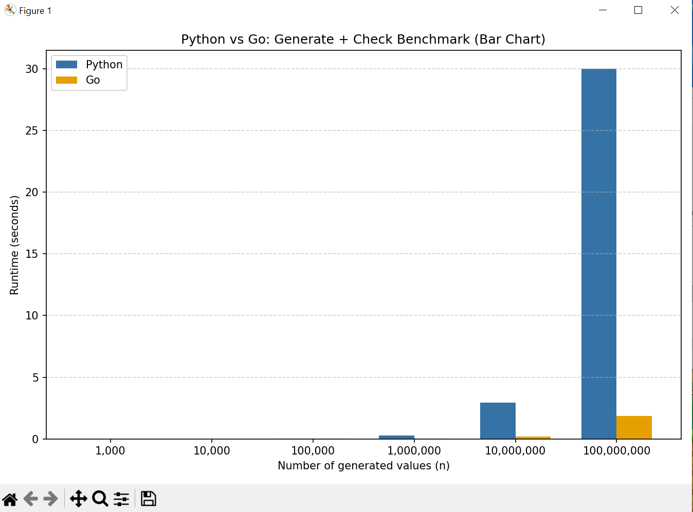

# Python vs Go Benchmark Comparison

This project compares the performance of a simple scanning algorithm implemented in **Python** and **Go**.  
Both versions run over increasing input sizes, and the results are visualized to show how the two languages differ in execution speed.

## Project Structure

python-go-benchmarks/
│
├── python/
│   └── scan_py.py          # Python implementation
│
├── go/
│   └── scan_go.go          # Go implementation
│
├── benchmarks/
│   ├── compare_plot.py     # Script to run benchmarks + generate plot
│   └── results.png         # Pre-generated benchmark plot
│
├── .gitignore
├── .gitattributes
└── README.md

## How to Run the Benchmarks

### Run the Python benchmark
\`\`\`bash
cd python
python scan_py.py
\`\`\`

### Run the Go benchmark
\`\`\`bash
cd go
go run scan_go.go
\`\`\`

### Generate the comparison plot
\`\`\`bash
cd benchmarks
python compare_plot.py
\`\`\`

This will run both algorithms, record runtimes, and regenerate the performance chart.

## Benchmark Results (No Execution Required)

If you do not want to run the code, the benchmark output is already included here:

This image shows the runtime comparison between Python and Go across multiple input sizes.

## Technologies Used
- Python 3.x  
- Go 1.x  
- Matplotlib for visualization  
- Custom benchmarking scripts  

## Summary

- Go significantly outperforms Python at larger input sizes due to its compiled execution and efficient loop handling.  
- Python performs comparably on small inputs due to low overhead.  
- This project demonstrates:  
  - Multi-language coding experience  
  - Benchmark design and reproducible testing  
  - Data visualization  
  - Understanding of performance differences between interpreted and compiled languages  

